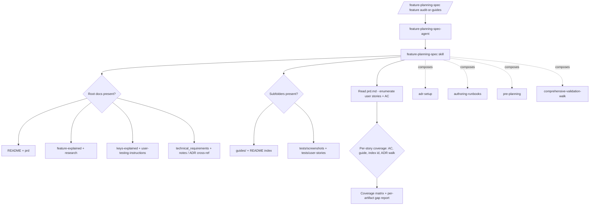

# System Docs: Feature Planning Spec

## Overview
Defines and enforces the **feature-folder planning spec** every feature must meet, and uses the per-user-story
guide set as the **basis for browser-walk testing**. The spec covers the planning-folder **root docs** (`README` +
`prd` + **`feature-explained`** + **`research`** + **`keys-explained`** + **`user-testing-instructions`** +
`technical_requirements`/`notes`), a **`guides/`** subfolder (one core guide per user story), a **`tests/`**
subfolder (`screenshots/` + `user-stories/`), the operational runbooks, and the ADR cross-ref. Governs *structure +
user-story coverage*; composes with `adr-setup` (ADR internals), `authoring-runbooks` (runbook shape),
`pre-planning` (plan files), and `comprehensive-validation-walk` (the walk). The spec is a **floor**, not a cap.

## Components (full component — dual-homed `.claude/` + `.codex/`)
| Component | Path |
|-----------|------|
| Skill | `skills/feature-planning-spec/SKILL.md` |
| Reference (audit checklist) | `skills/feature-planning-spec/references/minimum-spec-checklist.md` |
| Agent | `agents/feature-planning-spec-agent/AGENT.md` |
| Command | `commands/feature-planning-spec.md` (`/feature-planning-spec <feature> [audit|guides]`) |
| System docs | `system_docs/feature_planning_spec/README.md` + `USAGE_GUIDE.md` |
| Hook | **none — deliberate** (see "Hook decision" below) |
| Codex mirror | every file above mirrored under `.codex/…` |

## Hook decision (why there is no hook)
Per the component-creation pipeline, a hook is added **only if auto-triggering is needed** — it is not. Scaffolding
a feature is a **deliberate act** (you invoke `/feature-planning-spec` when a feature is in the works), and updating
an existing folder is **on request only** (the maintainer chose *no auto-backfill*). An auto-firing hook would be
noise and would violate that decision. The component is therefore **agent/command-invoked**, not hook-driven. (If a
"new `.docs/planning/f#-*` folder detected → suggest running the spec" nudge is ever wanted, it would be added here
and registered in `settings.json`.)

## The full spec (what it guarantees)
```
.docs/planning/<f#-feature>@<ver>/
  README.md                     # overview + status + open questions        [REQUIRED]
  prd.md                        # user stories (MoSCoW) + AC                 [REQUIRED]
  feature-explained.md          # narrative: what it is + how it works       [REQUIRED]
  research.md                   # grounding research (+ optional <topic>-)   [REQUIRED]
  keys-explained.md             # keys/creds/env/flags, VALUE-FREE           [REQUIRED]
  user-testing-instructions.md  # step-by-step human-in-the-loop testing     [REQUIRED]
  technical_requirements.md     # (or ADR cross-ref)                         [REQUIRED]
  notes.md                      # (or ADR cross-ref)                         [REQUIRED]
  guides/
    README.md                   # US# -> guide -> browser-walk id            [REQUIRED]
    <us-slug>.md                # one core guide per core user story         [REQUIRED]
  tests/
    screenshots/                # visual proof                               [REQUIRED]
    user-stories/               # per-story walk evidence / specs / videos   [REQUIRED]
    <feature>-test-report.md    # results summary
<app>/.app-docs/runbooks/<area>/         # shipped runbooks + user guides (source of truth)
.adr/orchestration/<f#-feature>@<ver>/   # technical + session detail; testing session <- guides
```

## Two modes
1. **Scaffold a NEW feature** (default) — create the folder to the full spec, seeded with feature-specific skeletons.
2. **Audit + update an EXISTING feature to spec — ON REQUEST** — audit, report gaps, additively fill only what's
   missing (never overwrite non-empty content without asking). **No auto-backfill** — existing folders change only
   when asked.

## Architecture


## The core rule
A feature folder is **spec-complete** only when every root doc + subfolder above exists **and** every user story in
`prd.md` has: acceptance criteria, a core guide in `guides/`, a browser-walk id in `guides/README.md`, and a walk in
the ADR testing session. The audit enumerates the stories and checks all four; any missing box is a gap
(Must-stories are release-blocking; Should/Could may be deferred with a written reason).

## Usage
- Scaffold: `/feature-planning-spec <feature>` — fill to the full spec + generate per-story guides.
- Audit only: `/feature-planning-spec <feature> audit` — coverage matrix + gap list, no writes.
- Guides: `/feature-planning-spec <feature> guides` — (re)generate the user-story guides.
See `USAGE_GUIDE.md` for the step-by-step + the per-doc content contract.

## Sync
The **component** (agent/skill/references/command/system_docs, `.claude/` + `.codex/`) syncs to `SYNC-REPOS.md`
targets via `/sync-component` → `/sync-flush`. Feature *content* it produces is project-local (never synced).
