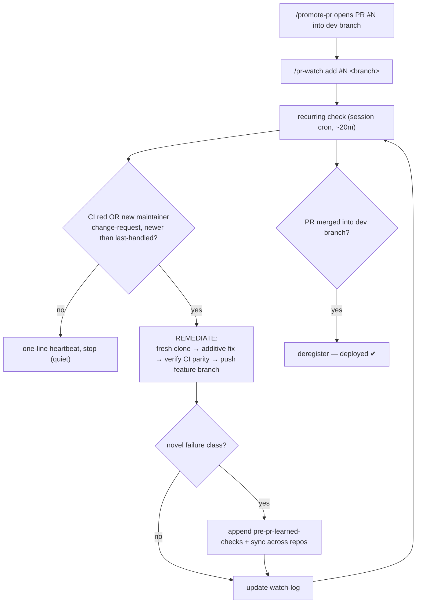

# PR Shepherd — runbook

Watch a submitted upstream contributor PR and shepherd it through every CI round and maintainer review
**until it is merged into the dev branch** (deployed). This maintainer (`fmchisti`) frequently returns
small gating issues shortly after each push; the shepherd catches each one, fixes it additively,
re-submits, and watches again — so the user does not have to babysit the PR.

Component: skill `pr-shepherd` · agent `pr-shepherd-agent` · command `/pr-watch` · state
`.chat-history/pr-watch-log.md` · learned checks `.docs/runbooks/development/pre-pr-learned-checks.md`.
Companion to `contributor-conventions` (opens the PR) + the pre-PR checklist (the checks it enforces).

---

## When it runs



## Prerequisites

- `repo.local.md` declares `contributor` (the shepherd is inert on an owner repo).
- The PR was opened by us into the upstream **dev branch** (via `/promote-pr`) and lives on a feature
  branch `<feature-id>@<handle>` on the upstream.
- An active Claude session with the Chrome extension available (detection is browser-based, in-session).
- pnpm **9.15.9** available for the CI-parity reproduction.

## Usage

| Command | Effect |
|---|---|
| `/pr-watch add <#N> <branch>` | register PR #N + start the ~20-min watcher |
| `/pr-watch status` | list watched PRs + last-handled state + whether the watcher is live |
| `/pr-watch check-now` | run one watch+remediate pass immediately |
| `/pr-watch remove <#N>` | deregister a PR (e.g. after it merges) |
| `/pr-watch stop` | stop the recurring watcher; keep the watch-list |

`/promote-pr` auto-registers the PR it opens, so in the normal flow you never call `add` by hand.

## The check (each firing, per PR)

1. Open `https://github.com/<upstream>/pull/<N>/checks` → read the **"Build, lint, typecheck, test"** job.
   RED (newer than last-handled) = a gating failure → open the failed job and read the exact error.
2. Open `https://github.com/<upstream>/pull/<N>` → read the newest comment/review by the **maintainer**
   (`fmchisti`). A change-request / "please fix X" newer than last-handled = a gating signal. Bots
   (Copilot / Cursor / Supabase) are not gating on their own.
3. If **Merged/Closed** → deregister (deployed).
4. Nothing new → one-line heartbeat, stop.

## The remediation (only on a new gating signal)

Identical to the by-hand pre-PR flow (§2/§3 of the pre-pr-checklist):

1. Fresh shallow clone of the PR branch (never the working tree):
   `git clone --depth 1 --branch '<branch>' --single-branch <upstream-url> "$TMP/cc-watch-<N>"` →
   `pnpm install --frozen-lockfile`.
2. **Additive** fix — add code/methods; adapt our code to the dev branch's current API. Never delete/revert
   the maintainer's code to satisfy a type error (C7).
3. Verify FULL CI parity green (build · lint 0-errors · typecheck · test with the CI env placeholders; no
   `*.test.ts` importing vitest).
4. Commit clean (NO AI/tool trailers), `CONTRIBUTOR_PUSH_OK=1 git push origin 'HEAD:<branch>'`.
5. Mirror the fix into the working tree `CC/` subtree, push our working remote.
6. Update `.chat-history/pr-watch-log.md`.

### CI env placeholders (from `.github/workflows/ci.yml`, the test step)
```
NODE_ENV=test
DATABASE_URL=postgresql://ci:ci@localhost:5432/ci
BACKEND_URL=http://localhost:3000
SUPABASE_URL=http://localhost:54321
SUPABASE_ANON_KEY=ci-placeholder-anon-key
SUPABASE_SERVICE_KEY=ci-placeholder-service-key
SIGNING_LINK_SECRET=ci-placeholder-signing-link-secret-32chars-min
SCRAPPER_SERVICE_KEY=ci-placeholder-scrapper-service-key
GOOGLE_DRIVE_API_KEY=ci-placeholder-google-key
```

## Self-improving checklist

A **novel** failure class (not already in `pre-pr-checklist.md` or `pre-pr-learned-checks.md`) is appended
to `pre-pr-learned-checks.md` (symptom → root cause → pre-submit check → fix pattern → source PR/date),
then propagated to every `SYNC-REPOS.md` target via `/sync-component pr-shepherd` → `/sync-flush`. This is
how the checklist grows and stays consistent across all our repos. Over time the pre-submit checks catch
these classes *before* the PR, shrinking the number of round-trips.

## Guardrails

- Feature branch only. NEVER push `development`/`website@dev`/`website@live`; NEVER merge.
- Push only an ADDITIVE fix verified GREEN. Ambiguous / large / design-decision / can't-go-green-additively
  → log "needs the user" in the watch-log and STOP; do not force.
- Quiet by default (heartbeat); substantive report only on an actual remediation.
- Dedup via the watch-log.

## Durable upgrade (optional, not the default)

The default watcher is a **session cron** (runs while a Claude session is open). For a watcher that
survives restarts and idle, register a Windows Scheduled Task on the idle-handoff pattern
(`register-idle-handoff.ps1`) that fires a bash monitor every ~20 min. That monitor needs a headless way to
read GitHub PR state — the `gh` CLI (one `gh auth login`) or a stored token — since the browser is
in-session only. Wire it the same way `idle-handoff-monitor.sh` is registered, invoking the
`pr-shepherd-agent` (via the subscription CLI) when it detects a new failure. Left as an opt-in because it
adds a `gh`/token dependency.

## Retiring a watcher
`/pr-watch stop` (or `CronDelete` the job). Deregister merged PRs with `/pr-watch remove <#N>`. When all
watched PRs have merged, stop the watcher.
